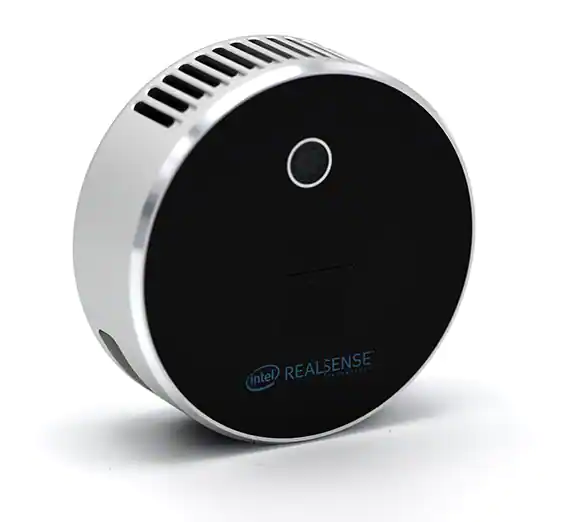

# Intel_REALSENSE_L515_manual

## 0. Introduction

以下主要介绍使用Linux（20.04）+ ROS（ Noetic Ninjemys ）获取L515中的数据



## 1. Dependence

* ROS( Noetic Ninjemys )
* SDK
* Ddynamic_reconfigure
* RealSense™ ROS

## 2. Installation

### ROS( Noetic Ninjemys )

参考以下链接：

http://wiki.ros.org/noetic/Installation/Ubuntu

### SDK

*Ubuntu*

Install librealsense2 debian package:

 [Linux Debian Installation Guide](https://github.com/IntelRealSense/librealsense/blob/master/doc/distribution_linux.md#installing-the-packages)

* Register the server's public key:

	```
	sudo apt-key adv --keyserver keyserver.ubuntu.com --recv-key F6E65AC044F831AC80A06380C8B3A55A6F3EFCDE || sudo apt-key adv --keyserver hkp://keyserver.ubuntu.com:80 --recv-key F6E65AC044F831AC80A06380C8B3A55A6F3EFCDE
	```

* Add the server to the list of repositories:

	````
	sudo add-apt-repository "deb https://librealsense.intel.com/Debian/apt-repo 		$(lsb_release -cs) main" -u
	````

* Install the libraries:

  The below two lines will deploy librealsense2 udev rules, build and activate kernel modules, runtime library and executable demos and tools.
  
  ````
  sudo apt-get install librealsense2-dkms
  sudo apt-get install librealsense2-utils
  ````

- Install the developer and debug packages:
  
  ````
  sudo apt-get install librealsense2-dev
  sudo apt-get install librealsense2-dbg
  ````
  
  
  With `dev` package installed, you can compile an application with **librealsense** using `g++ -std=c++11 filename.cpp -lrealsense2` or an IDE of your choice.

Reconnect the Intel RealSense depth camera and run: `realsense-viewer` to verify the installation.

Verify that the kernel is updated :
`modinfo uvcvideo | grep "version:"` should include `realsense` string


#### OR

* Build from sources by downloading the latest [Intel® RealSense™ SDK 2.0](https://github.com/IntelRealSense/librealsense/releases/tag/v2.50.0) and follow the instructions under [Linux Installation](https://github.com/IntelRealSense/librealsense/blob/master/doc/installation.md)


### Ddynamic_reconfigure

GitHub库：https://github.com/pal-robotics/ddynamic_reconfigure

clone到src目录后编译

````shell
git clone https://github.com/pal-robotics/ddynamic_reconfigure.git
cd ..
catkin_make
````


### Intel® RealSense™ ROS

- Create a [catkin](http://wiki.ros.org/catkin#Installing_catkin) workspace *Ubuntu*

```
mkdir -p ~/catkin_ws/src
cd ~/catkin_ws/src/
```

*Windows*

```
mkdir c:\catkin_ws\src
cd c:\catkin_ws\src
```

- Clone the latest Intel® RealSense™ ROS from [here](https://github.com/intel-ros/realsense/releases) into 'catkin_ws/src/'

```
git clone https://github.com/IntelRealSense/realsense-ros.git
cd realsense-ros/
git checkout `git tag | sort -V | grep -P "^2.\d+\.\d+" | tail -1`
cd ..
```

- Make sure all dependent packages are installed. You can check .travis.yml file for reference.
- Specifically, make sure that the ros package *ddynamic_reconfigure* is installed. If *ddynamic_reconfigure* cannot be installed using APT or if you are using *Windows* you may clone it into your workspace 'catkin_ws/src/' from [here](https://github.com/pal-robotics/ddynamic_reconfigure/tree/kinetic-devel)

```
catkin_init_workspace
cd ..
catkin_make clean
catkin_make -DCATKIN_ENABLE_TESTING=False -DCMAKE_BUILD_TYPE=Release
catkin_make install
```

*Ubuntu*

```
echo "source ~/catkin_ws/devel/setup.bash" >> ~/.bashrc
source ~/.bashrc
```

*Windows*

```
devel\setup.bat
```


## 3. Run

### Start the camera node

To start the camera node in ROS:

```
roslaunch realsense2_camera rs_camera.launch
```

This will stream all camera sensors and publish on the appropriate ROS topics.

Other stream resolutions and frame rates can optionally be provided as parameters to the 'rs_camera.launch' file.

可以通过`ros topic list`查看是否正在运行

### Published Topics

The published topics differ according to the device and parameters. After running the above command with D435i attached, the following list of topics will be available (This is a partial list. For full one type `rostopic list`):

- /camera/color/camera_info
- /camera/color/image_raw
- /camera/color/metadata
- /camera/depth/camera_info
- /camera/depth/image_rect_raw
- /camera/depth/metadata
- /camera/extrinsics/depth_to_color
- /camera/extrinsics/depth_to_infra1
- /camera/extrinsics/depth_to_infra2
- /camera/infra1/camera_info
- /camera/infra1/image_rect_raw
- /camera/infra2/camera_info
- /camera/infra2/image_rect_raw
- /camera/gyro/imu_info
- /camera/gyro/metadata
- /camera/gyro/sample
- /camera/accel/imu_info
- /camera/accel/metadata
- /camera/accel/sample
- /diagnostics

> Using an L515 device the list differs a little by adding a 4-bit confidence grade (pulished as a mono8 image):
>
> - /camera/confidence/camera_info
> - /camera/confidence/image_rect_raw
>
> It also replaces the 2 infrared topics with the single available one:
>
> - /camera/infra/camera_info
> - /camera/infra/image_raw

The "/camera" prefix is the default and can be changed. Check the rs_multiple_devices.launch file for an example. If using D435 or D415, the gyro and accel topics wont be available. Likewise, other topics will be available when using T265 (see below).

更多节点信息细节：https://github.com/IntelRealSense/realsense-ros

### Point Cloud

Here is an example of how to start the camera node and make it publish the point cloud using the pointcloud option.

```
roslaunch realsense2_camera rs_camera.launch filters:=pointcloud
```

Then open rviz to watch the pointcloud

### Aligned Depth Frames

Here is an example of how to start the camera node and make it publish the aligned depth stream to other available streams such as color or infra-red.

```
roslaunch realsense2_camera rs_camera.launch align_depth:=true
```

### Set Camera Controls Using Dynamic Reconfigure Params

The following command allow to change camera control values using [http://wiki.ros.org/rqt_reconfigure].

```
rosrun rqt_reconfigure rqt_reconfigure
```


## Reference

* https://github.com/IntelRealSense/realsense-ros
* http://wiki.ros.org/ROS/Installation


